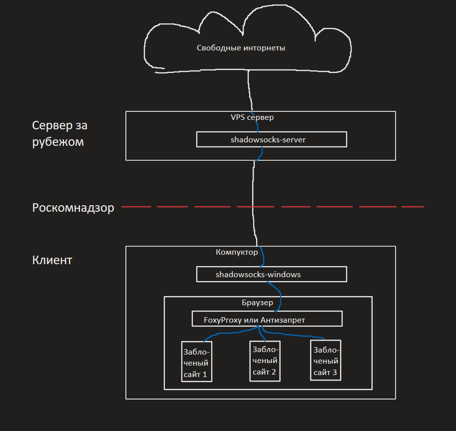

## Универсальный гайд по клиентам shadowsocks

### Содержание:
1. [Вступление](ss-clients.md#вступление)
2. [Настройка клиентов Android](ss-clients.md#настройка-клиентов-android)
3. [Настройка клиентов Windows](ss-clients.md#настройка-клиентов-windows)
4. [Настройка клиентов Linux](ss-clients.md#настройка-клиентов-linux)
5. [Настройка клиентов macOS](ss-clients.md#настройка-клиентов-macos)
6. [Настройка браузеров](ss-clients.md#настройка-браузеров)

### Вступление

Данный гайд нацелен на помощь в установке и настройке клиентов shadowsocks как без обфускации, так и с обфускацией трафика при помощи плагинов V2ray или Xray. 

### Настройка клиентов Android
+ [SagerNet](https://f-droid.org/packages/io.nekohasekai.sagernet/)
+ [AnXray](https://f-droid.org/packages/io.nekohasekai.anXray/)

### Настройка клиентов Windows
+ [shadowsocks-windows](https://github.com/shadowsocks/shadowsocks-windows/releases/latest)
+ [v2ray-plugin](https://github.com/shadowsocks/v2ray-plugin/releases/latest)
+ [xray-plugin](https://github.com/teddysun/xray-plugin/releases/latest)

### Настройка клиентов Linux
+ [v2rayA](https://v2raya.org/en/docs/prologue/installation/)

### Настройка клиентов macOS
+ [clashX](https://github.com/yichengchen/clashX/releases/latest)
+ [V2RayXS](https://github.com/tzmax/V2RayXS/releases/latest)

### Настройка браузеров
+ [FoxyProxy](https://getfoxyproxy.org/downloads/#proxypanel)
+ [Антизапрет](https://antizapret.prostovpn.org/)
  
