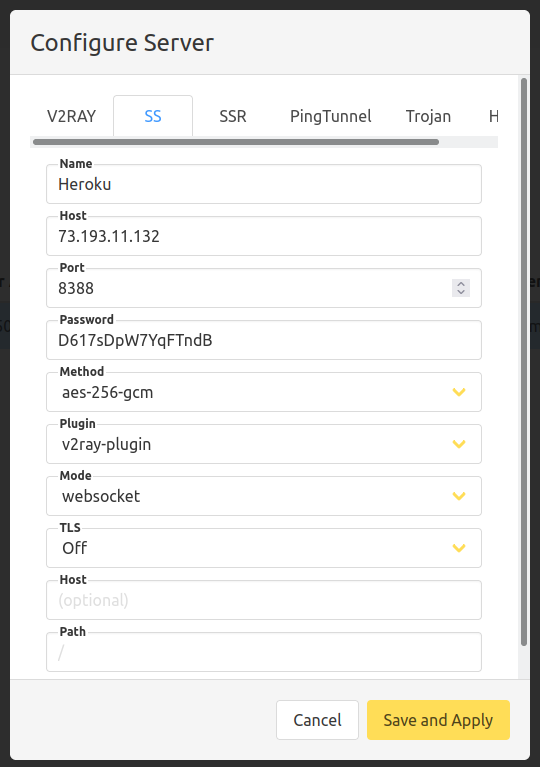
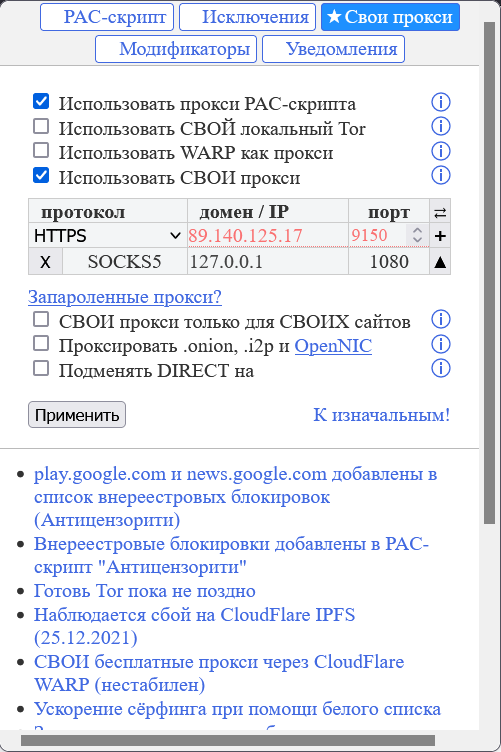

## Универсальный гайд по клиентам shadowsocks

### Содержание:
1. [Вступление](ss-clients.md#вступление)
2. [Настройка клиентов Android](ss-clients.md#настройка-клиентов-android)
3. [Настройка клиентов Windows](ss-clients.md#настройка-клиентов-windows)
4. [Настройка клиентов Linux](ss-clients.md#настройка-клиентов-linux)
5. [Настройка клиентов macOS](ss-clients.md#настройка-клиентов-macos)
6. [Настройка браузеров](ss-clients.md#настройка-браузеров)

### Вступление

Данный гайд нацелен на помощь в установке и настройке клиентов shadowsocks как без обфускации, так и с обфускацией трафика при помощи плагинов V2ray или Xray. Предполагается, что читатель уже установил личный сервер shadowsocks по одному из гайдов в шапке треда, например по гайду [shadowsocks-rust](docker-ss-v2ray.md)

### Настройка клиентов Android
Для обычного shadowsocks или для shadowsocks с обфускацией при помощи v2ray рекомендуется использовать приложение [SagerNet](https://f-droid.org/packages/io.nekohasekai.sagernet/)

Добавление подключения к серверу shadowsocks производится следующим образом:
1. В правом верхнем углу нажимаем на плюсик => Ручные настройки => Shadowsocks
2. Заполняем поля по принципу как на скриншоте снизу
3. Удаленный порт зависит от гайда, по которому был установлен сервер shadowsocks, но чаще всего это 8388 или 443
4. Метод шифрования также зависит от гайда. Для гайда по shadowsocks-rust правильный метод шифрования выбран по умолчанию (AES-256-GCM)
5. Если на сервере установлен плагин обфускации v2ray, соотвествующий плагин следует выбрать в приложении
6. Далее остаётся выбрать созданый профиль и нажать на самолётик в правом нижнем углу. Работоспособность профиля проверяется нажатием на панель в нижней части экрана
    
На скриншоте пример корректной настройки

Shadowsocks с обфускацией через Xray настраивается аналогичным образом. Требуется предварительная установка [xray-plugin](https://github.com/teddysun/xray-plugin/releases/latest).

### Настройка клиентов Windows
1. Первым делом следует скачать [shadowsocks-windows](https://github.com/shadowsocks/shadowsocks-windows/releases/latest) и распаковать в отдельную папку
2. Затем скачать один из плагинов ниже (версию с суффиксом windows-amd64) и положить в папку, в которую ранее был установлен shadowsocks:
+ [v2ray-plugin](https://github.com/shadowsocks/v2ray-plugin/releases/latest)
+ [xray-plugin](https://github.com/teddysun/xray-plugin/releases/latest)
3. Переименовать исполняемый файл плагина в v2ray-plugin.exe или xray-plugin.exe соотвественно
4. Теперь вводим все данные сервера
5. В графе "Плагин" пишем v2ray-plugin или xray-plugin в зависимости от того какой плагин установлен на сервере
6. Поле опции плагина можно оставить пустым
7. Так как shadowsocks-windows не поддерживает прозрачный прокси (режим VPN), переходим к разделу [настройка браузеров](ss-clients.md#настройка-браузеров)

На скриншоте пример корректной настройки

### Настройка клиентов Linux
1. Скачиваем [v2rayA](https://v2raya.org/en/docs/prologue/installation/) для своего дистрибутива
2. Далее следуем инструкциям по установке на сайте
3. После успешной установки открываем в браузере страницу http://localhost:2017
4. Создаём логин и пароль для входа в клиент
5. После успешного входа жмём на кнопку Create и на вкладке SS заполняем данные сервера. На этом этапе важно не забыть выбрать плагин, если на сервере таковой установлен
6. Теперь подключаемся к серверу. Для этого переходим на вкладку SERVER, тыкаем Select, после этого нажимаем на красную кнопку в верхнем левом углу
7. Далее следует проверить подключение к серверу. Для этого ставим галочку напротив подключения и нажимаем на кнопку HTTP
8. Если всё ок, то переходим к разделу [настройка браузеров](ss-clients.md#настройка-браузеров)

<!--
### Настройка клиентов macOS
+ [clashX](https://github.com/yichengchen/clashX/releases/latest)
+ [V2RayXS](https://github.com/tzmax/V2RayXS/releases/latest)
-->

### Настройка браузеров
1. Качаем расширение [Антизапрет](https://antizapret.prostovpn.org/) для своего браузера
2. Если используется Firefox, нужно разрешить расширению запуск в приватных окнах
3. После этого настраиваем антизапрет как на скриншоте. Порт может отличаться (например, на линуксе порт равен 20170)
4. На вкладке PAC-скрипт следует выбрать Антицензорити
5. На данном этапе всё должно работать. При желании расширению антизапрета можно указать отдельные сайты для проксированния

Если нужно проксировать все сайты, удобнее всего это делать через [SwitchyOmega](https://chrome.google.com/webstore/detail/proxy-switchyomega/padekgcemlokbadohgkifijomclgjgif). Расширение позволяет включать или выключать прокси всего за два клика  