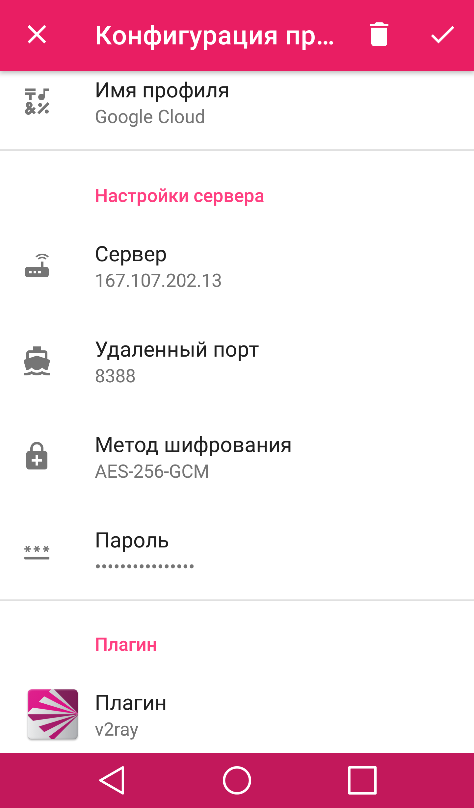

## Универсальный гайд по клиентам shadowsocks

### Содержание:
1. [Вступление](ss-clients.md#вступление)
2. [Настройка клиентов Android](ss-clients.md#настройка-клиентов-android)
3. [Настройка клиентов Windows](ss-clients.md#настройка-клиентов-windows)
4. [Настройка клиентов Linux](ss-clients.md#настройка-клиентов-linux)
5. [Настройка клиентов macOS](ss-clients.md#настройка-клиентов-macos)
6. [Настройка браузеров](ss-clients.md#настройка-браузеров)

### Вступление

Данный гайд нацелен на помощь в установке и настройке клиентов shadowsocks как без обфускации, так и с обфускацией трафика при помощи плагинов V2ray или Xray. Предполагается, что читатель уже установил личный сервер shadowsocks по одному из гайдов в шапке треда, например по гайду [shadowsocks-rust](docker-ss-v2ray.md)

### Настройка клиентов Android
Для обычного shadowsocks без обфускации и для shadowsocks с обфускацией при помощи v2ray рекомендуется приложение [SagerNet](https://f-droid.org/packages/io.nekohasekai.sagernet/)

Добавление подключения к серверу shadowsocks производится следующим образом:
1. В правом верхнем углу нажимаешь на плюсик
2. Выбираешь ручные настройки
3. Выбираешь Shadowsocks
4. Далее нужно придумать имя профиля и заполнить данные
5. Внешний адрес своей виртуальной машины следует указать в графе "Сервер"
6. Удаленный порт зависит от гайда, по которому был установлен shadowsocks, но чаще всего это 8388 или 443
7. Метод шифрования также зависит от гайда. Для гайда по shadowsocks-rust верный метод шифрования выбран по умолчанию (AES-256-GCM)
8. Указываем пароль
9. Если на сервере установлен плагин обфускации v2ray, соотвествующий плагин следует выбрать в приложении
10. Далее остаётся лишь выбрать созданый профиль и нажать на самолётик в правом нижнем углу. Работоспособность профиля проверяется нажатием на панель в нижней части экрана
    
На скриншоте пример корректной настройки

Для shadowsocks с обфускацией через Xray рекомендуется [AnXray](https://f-droid.org/packages/io.nekohasekai.anXray/). Настройка производится по аналогии с SagerNet

### Настройка клиентов Windows
+ [shadowsocks-windows](https://github.com/shadowsocks/shadowsocks-windows/releases/latest)
+ [v2ray-plugin](https://github.com/shadowsocks/v2ray-plugin/releases/latest)
+ [xray-plugin](https://github.com/teddysun/xray-plugin/releases/latest)

### Настройка клиентов Linux
+ [v2rayA](https://v2raya.org/en/docs/prologue/installation/)

### Настройка клиентов macOS
+ [clashX](https://github.com/yichengchen/clashX/releases/latest)
+ [V2RayXS](https://github.com/tzmax/V2RayXS/releases/latest)

### Настройка браузеров
+ [FoxyProxy](https://getfoxyproxy.org/downloads/#proxypanel)
+ [Антизапрет](https://antizapret.prostovpn.org/)
  
